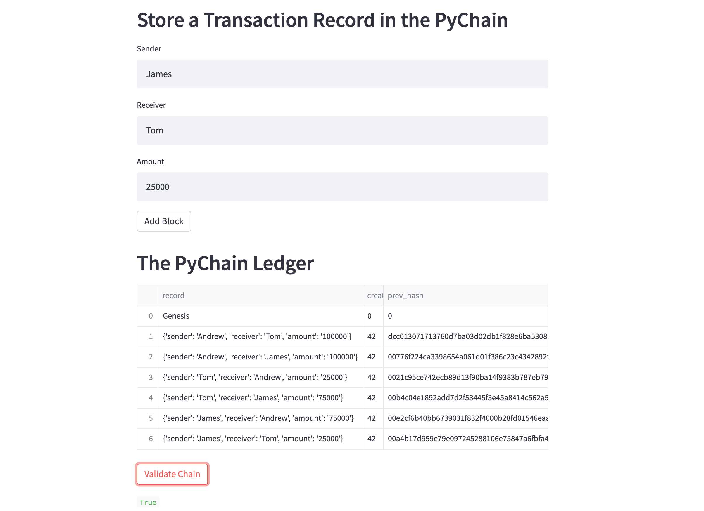
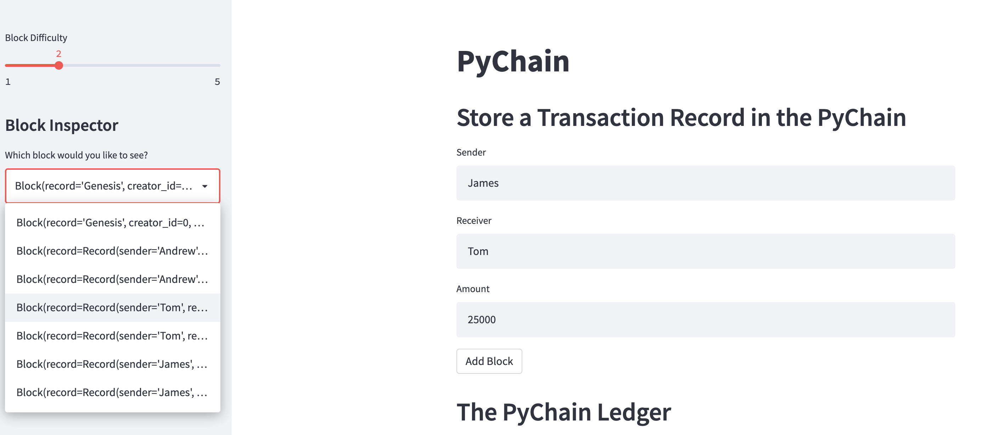
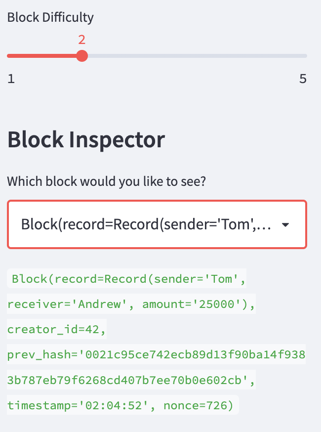

# PyChain Ledger


A blockchain-based ledger system, complete with a user-friendly web interface. This ledger should allow companies to conduct financial transactions (that is, to transfer money between senders and receivers) and to verify the integrity of the data in the ledger.

## Four Main Tasks
1. Create a new data class named `Record`. This class will serve as the blueprint for the financial transaction records that the blocks of the ledger will store.

2. Store the `Record` data in the `Block` data class.

3. Add Relevant User Inputs to the Streamlit interface.

4. Test the PyChain Ledger by Storing Records.

---
## Files

[PyChain Ledger File](Code/pychain.py)

---

## Step 1: Create a Record Data Class

```
@dataclass
class Record:
    sender: str
    receiver: str
    amount: float
```

### Step 2: Modify the Existing Block Data Class to Store Record Data

```
@dataclass
class Block:

    record: Record

    creator_id: int
    prev_hash: str = "0"
    timestamp: str = datetime.datetime.utcnow().strftime("%H:%M:%S")
    nonce: int = 0
```

### Step 3: Add Relevant User Inputs to the Streamlit Interface

 ```
sender = st.text_input("Sender")
receiver = st.text_input("Receiver")
amount = st.text_input("Amount")
 ```  

### Step 4: Test the PyChain Ledger by Storing Records

1. In the terminal, navigate to the project folder where the code is located.

2. In the terminal, run the Streamlit application by using `streamlit run pychain.py`.

3. Enter values for the sender, receiver, and amount, and then click the Add Block button. Do this several times to store several blocks in the ledger.

4. Verify the block contents and hashes in the Streamlit dropdown menu.




5. Test the blockchain validation process by using the web interface.

Block Inspector             |  Selected Block Inspector
:-------------------------:|:-------------------------:
   |  